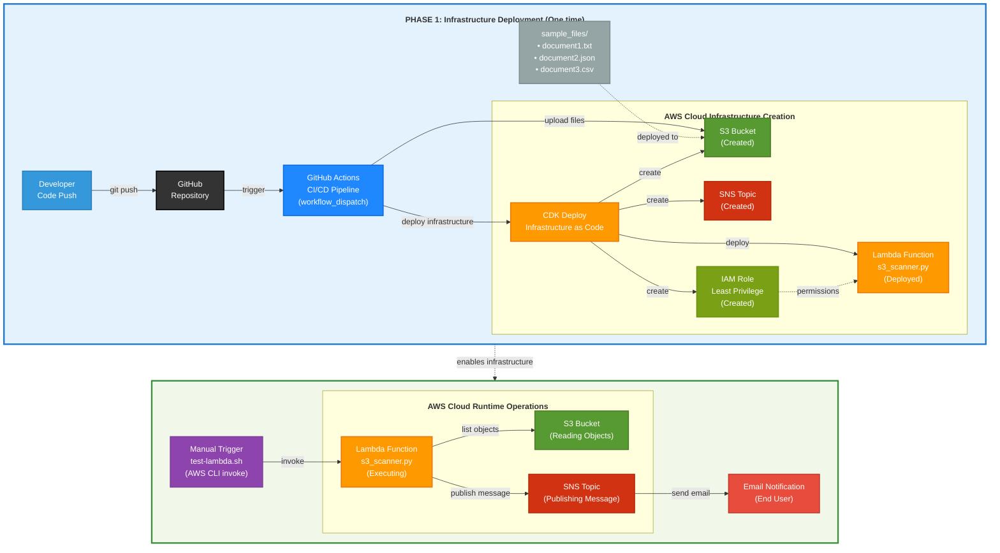

# Serverless S3 Scanner

A fully automated serverless application on AWS that scans S3 bucket objects and sends email notifications. Built with Infrastructure as Code (IaC) for a DevOps portfolio demonstration.

## Project Overview

This project demonstrates DevOps skills including:
- Infrastructure as Code using AWS CDK
- CI/CD pipeline with GitHub Actions
- Serverless architecture with AWS Lambda
- Automated deployment and testing

The application consists of two main phases:
1. **Deployment Phase**: Code is pushed to GitHub, triggering automated infrastructure deployment via GitHub Actions and CDK
2. **Runtime Phase**: Lambda function can be manually triggered to scan S3 objects and send email notifications via SNS

## Architecture

I designed this system with two main phases based on examples I found online:



The system works in two phases:
- **Phase 1 (Blue)**: One-time infrastructure deployment via GitHub Actions and CDK
- **Phase 2 (Green)**: Repeatable runtime operations triggered manually

**[Explore Interactive Version](https://app.ilograph.com/@serverless-s3-scanner/serverless-s3-scanner)** - Click to see detailed interactive diagrams with additional perspectives.

### AWS Resources Created
- **S3 Bucket**: Stores sample files and serves as scan target
- **Lambda Function**: Scans S3 objects and publishes results
- **SNS Topic**: Sends email notifications with scan results
- **IAM Role**: Provides least-privilege permissions for Lambda
- **Sample Files**: Automatically uploaded during deployment

## Tools and Frameworks Used

After researching different options, I chose:

- **AWS CDK** (Python) - I found this easier than raw CloudFormation
- **AWS Lambda** (Python 3.13) - Good for simple serverless functions
- **GitHub Actions** - Free CI/CD that integrates well with GitHub
- **AWS CLI** - For manual testing and troubleshooting
- **pytest** - Standard Python testing framework

## Prerequisites

Before starting, ensure you have:

1. **AWS Account** with appropriate permissions
2. **AWS CLI** installed and configured
   ```bash
   aws configure
   # Set your region to eu-west-1 (or update code for your region)
   ```
3. **Git** installed
4. **GitHub Account**
5. **Node.js** (18+) and **Python** (3.13+)

## Setup and Deployment

### Step 1: Clone Repository
```bash
git clone https://github.com/sahareitam/serverless-s3-scanner.git
cd serverless-s3-scanner
```

### Step 2: Configure AWS Credentials in GitHub

1. Go to your GitHub repository
2. Navigate to **Settings** → **Secrets and variables** → **Actions**
3. Click **"New repository secret"** and add:
   - **Name**: `AWS_ACCESS_KEY_ID` **Value**: [Your AWS Access Key]
   - **Name**: `AWS_SECRET_ACCESS_KEY` **Value**: [Your AWS Secret Key]

**Important**: Create an IAM user with AdministratorAccess policy (For learning/portfolio projects, full access simplifies setup)

### Step 3: Configure Email Address

Update the email address in `lambda/config.py` to receive notifications:
```python
# Change this to your email address
NOTIFICATION_EMAIL = "your-email@example.com"
```

Commit the change:
```bash
git add lambda/config.py
git commit -m "Update email address for notifications" 
git push origin main
```

### Step 4: Deploy Infrastructure

1. Go to **GitHub Repository** → **Actions** tab
2. Click on **"Deploy Serverless S3 Scanner"** workflow
3. Click **"Run workflow"** → **"Run workflow"**
4. Wait for deployment to complete (5-10 minutes)

The workflow will:
- Install dependencies
- Run CDK bootstrap (if needed)
- Deploy all AWS infrastructure
- Upload sample files to S3

### Step 5: Confirm SNS Email Subscription

**Important**: After deployment, check your email for a confirmation message from AWS SNS.

1. Look for email from `no-reply@sns.amazonaws.com`
2. Subject: "AWS Notification - Subscription Confirmation"
3. **Click "Confirm subscription"** in the email
4. You should receive a confirmation: "Subscription confirmed"

**Note**: Without email confirmation, you won't receive scan result notifications.

## Manual Lambda Testing

### Using the Test Script

The repository includes a bash script for manual testing:

```bash
# Make script executable
chmod +x scripts/test-lambda.sh

# Run the test
./scripts/test-lambda.sh
```

**Expected Output:**
```
Testing S3Scanner Lambda Function...
======================================
Function: S3Scanner
Region: eu-west-1

Invoking Lambda function...
{
    "StatusCode": 200,
    "ExecutedVersion": "$LATEST"
}

Lambda invocation successful!
Response from Lambda:
=====================
{
  "statusCode": 200,
  "message": "S3 scan completed successfully. Found 3 objects in serverless-s3-scanner-files-[your-account-id]",
  "scanResults": {
    "bucketName": "serverless-s3-scanner-files-[your-account-id]",
    "objectCount": 3,
    "scanDuration": 3.6,
    "timestamp": "2025-07-19T15:42:58Z"
  }
}

 Check your email for scan results!
```

### Using AWS CLI Directly

Alternatively, invoke the Lambda function directly:

```bash
aws lambda invoke \
    --function-name S3Scanner \
    --region eu-west-1 \
    --payload '{}' \
    --cli-binary-format raw-in-base64-out \
    response.json

cat response.json
```

### Expected Email Notification

After running the test, you should receive an email like:

```
Subject: [Serverless S3 Scanner] S3 Bucket Scan Results

Hello,

The Serverless S3 Scanner has completed a scan of your S3 bucket.

Scan Details:
- Bucket Name: serverless-s3-scanner-files-[your-account-id]
- Scan Time: 2025-07-19T15:42:58Z
- Total Objects Found: 3
- Scan Duration: 3.6 seconds

Objects Found:
  • document1.txt (0.0 MB) - Modified: 2025-07-19 12:55:35 UTC
  • document2.json (0.0 MB) - Modified: 2025-07-19 12:55:35 UTC  
  • document3.csv (0.0 MB) - Modified: 2025-07-19 12:55:36 UTC

This is an automated message from the Serverless S3 Scanner.
Application Version: 1.0.0
```

## Project Structure

Here's how I organized the code:

```
serverless-s3-scanner/
├── README.md                           # This file
├── .github/workflows/deploy.yml        # GitHub Actions CI/CD
├── infrastructure/                     # CDK Infrastructure code
│   ├── app.py                         # CDK app entry point
│   ├── serverless_s3_scanner_stack.py # Main stack definition
│   ├── requirements.txt               # CDK dependencies
│   └── cdk.json                       # CDK configuration
├── lambda/                            # Lambda function code
│   ├── s3_scanner.py                  # Main Lambda handler
│   ├── config.py                      # Configuration settings
│   └── requirements.txt               # Lambda dependencies
├── sample_files/                      # Test files for S3
│   ├── document1.txt                  # Sample text file
│   ├── document2.json                 # Sample JSON file
│   └── document3.csv                  # Sample CSV file
├── scripts/                           # Utility scripts
│   └── test-lambda.sh                 # Manual Lambda test script
└── tests/                             # Unit tests
    ├── test_s3_scanner.py             # Lambda function tests
    └── test_config.py                 # Configuration tests
```

## Troubleshooting

### Common Issues

**1. GitHub Actions Deployment Fails**
```bash
# Check AWS credentials are set correctly in GitHub Secrets
# Verify IAM user has required permissions
# Review the failed workflow run in GitHub Actions tab for error details
```

**2. Lambda Function Not Found**
```bash
# Ensure deployment completed successfully
# Check correct region (eu-west-1)
cd infrastructure
aws lambda list-functions --region eu-west-1
```

**3. Not Receiving Email Notifications**
```bash
# Verify SNS subscription is confirmed
# Check spam/junk folder
# Verify email address in config.py matches subscription
```

**4. S3 Access Denied**
```bash
# Check IAM role permissions
# Verify bucket exists in correct region
aws s3 ls s3://serverless-s3-scanner-files-[your-account-id]
```

### Region Configuration

This project uses **eu-west-1** because that's what I had configured. To use a different region:

1. Update `lambda/config.py`:
   ```python
   AWS_REGION = os.environ.get('AWS_REGION', 'your-region')
   ```
2. Update `.github/workflows/deploy.yml`:
   ```yaml
   aws-region: your-region
   ```
3. Configure your AWS CLI:
   ```bash
   aws configure set region your-region
   ```

## Cleanup

To remove all AWS resources:

```bash
cd infrastructure
cdk destroy
```

This will delete:
- Lambda function
- S3 bucket and all objects
- SNS topic and subscriptions
- IAM roles and policies

## What I Learned

This project helped me understand:
- How Infrastructure as Code works with CDK
- Setting up CI/CD pipelines with GitHub Actions
- AWS Lambda integration with other services
- The importance of proper IAM permissions

---

**Author**: Sahar Eitam  
**Repository**: https://github.com/sahareitam/serverless-s3-scanner